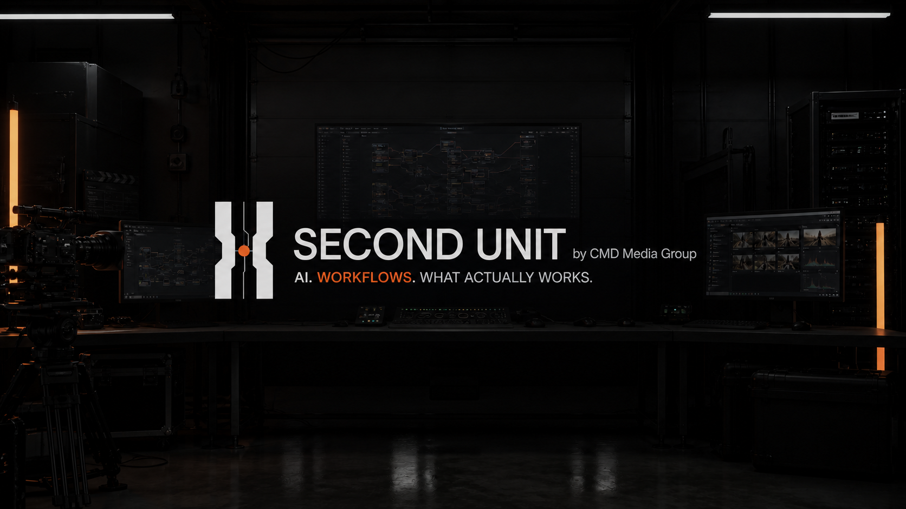

<p align="center"></p>

# Second Unit — Custom Workflow Preview

**By CMD Media Group.** Load a compatible ComfyUI workflow from DaVinci Resolve Studio, generate footage, and bring the result into your edit.

This preview does not include generation presets. Bundled workflows are being corrected and tested for a later release. Custom workflows remain the user's responsibility; passing the import check does not certify visual quality.

## Install on Windows

Requires DaVinci Resolve Studio, Python 3.9 or newer, ffmpeg and ffprobe on PATH, and a local ComfyUI server with your workflow's models and custom nodes installed. Keep this entire extracted folder in a permanent, writable location.

Close the Second Unit panel. In PowerShell, from the extracted folder:

```powershell
.\resolve-panel\Deploy-Panel.ps1 -ComfyUrl http://127.0.0.1:8188
```

If Resolve is already running and the panel is closed, add `-PanelClosedConfirmed`. Use `-Python C:\path\to\python.exe` if Python is not on PATH. The installer backs up the existing panel and settings and enables automatic progress for the off-air preview check.

Open **Workspace → Workflow Integrations → Second Unit**. Restart Resolve after a first installation if the menu entry is missing.

## Load your workflow

1. Start ComfyUI and confirm that your workflow runs there.
2. Export the workflow in **API JSON format**. The normal canvas JSON export is not accepted.
3. In Second Unit, press **LOAD WORKFLOW** and select the exported file.
4. The panel checks registered nodes, required inputs, and model availability. A passing import is selected and labeled **custom**.
5. Type your prompt in **SHOT**, choose a short duration, supply any required source/reference media, and generate.

This preview recognizes compatible MiniMax H3, LTX 2.3/2.5, WAN 2.2, and SAM 3.1 workflow families. It is not a universal runner for arbitrary graphs. Video workflows need supported input/output nodes and delivery formats; the panel may adapt frame counts, prompts, and output settings. Begin with a short test.

Prompt expansion is unavailable in this preview; use manual prompts. Optional features that require bundled finish or helper workflows are unavailable unless you supply compatible files. Models, footage, and generation workflows are not distributed with this package.

## Before going live

Test import, generation, progress without clicking, and the returned clip's placement in a disposable Resolve timeline. Report issues with the workflow name and sanitized error text. Do not post credentials, private media, or personal logs.

## License

See [LICENSE](LICENSE), [NOTICE](NOTICE), and [third-party notices](THIRD_PARTY_NOTICES.md). The software is source available under PolyForm Perimeter 1.0.1; brand assets identify the official CMD Media Group product. Earlier releases retain their original grants.
